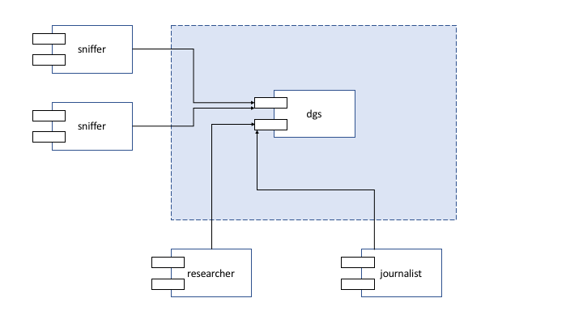
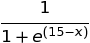

StaySafe: Parte 1
=================

O objetivo do projeto de Sistemas Distribuídos (SD) é desenvolver o sistema **StaySafe**, que permite o cálculo da probabilidade de uma pessoa estar infetada com dado vírus.
_(NB: Qualquer semelhança com a realidade atual é pura coincidência.)_
O sistema será concretizado através de um conjunto de serviços gRPC implementados na plataforma Java.

O projeto está estruturado em duas partes.
Este documento apresenta a primeira parte do projeto, onde se descreve o contexto, os principais componentes da arquitetura e os requisitos a satisfazer nesta parte.

1 Introdução
------------

Uma das melhores formas de evitar uma pandemia, ou atenuar os seus efeitos, é através da deteção rápida das pessoas infetadas, de modo a permitir o seu confinamento precoce.
Dada a utilização generalizada de equipamentos móveis com funções sensoriais e de geo-localização (smartphones, smartwatches, etc.), é hoje em dia possível cruzar a localização e movimentação das pessoas e construir mapas das suas interações inter-pessoais, de modo a detetar uma possível infeção através da análise das redes de contactos de cada indivíduo.
Esta "vigilância", embora tenha uma justificação sanitária relevante, coloca questões éticas que é fundamental considerar num Estado livre e democrático.
Nesse sentido, é importante que os cidadãos tenham acesso à melhor informação disponível, nomeadamente através do tratamento e estudo dos dados pela comunidade académica e sua divulgação pelos meios de comunicação. 

Neste contexto, o objetivo do **StaySafe** é permitir a académicos e jornalistas devidamente credenciados o acesso, a cada momento, ao valor das _probabilidade de infeção_, quer a nível individual (de cada pessoa registada no sistema), quer de forma agregada.

2 Arquitetura do sistema
------------------------

O sistema **StaySafe** assume que os indivíduos que querem participar instalam uma aplicação no seu smartphone/smartwatch que comunica com um sistema de recolha de informação existente em diversos espaços (comerciais, empresariais): o *sniffer*.
O sistema inclui também o *dgs* _(data get server)_ que armazena observações e que responde a interrogações feitas por dois tipos de clientes: *journalists* e *researchers*.

A figura seguinte mostra uma visão global dos componentes da solução.

Na primeira parte vai construir-se uma primeira versão de todos os componentes: *sniffer*, *dgs*, *journalist* e *researcher*. 
A seguir especificam-se detalhes sobre cada componente.

2.1 Servidor *dgs*
-------------------

O servidor *dgs* regista os *sniffers*, recebe e armazena as suas observações e responde a pesquisas dos *researchers* e *journalists*.

As operações a disponibilizar por um servidor *dgs* são as seguintes:

-   `sniffer_join` -- regista um *sniffer*.  
Recebe o nome de um novo sniffer e o seu endereço (morada).  
O nome indicado tem que ser único, i.e. não pode ser duplicado de um já existente.  
É possível registar várias vezes um sniffer com o mesmo nome e mesmo endereço;

-   `sniffer_info` -- recebe o nome de um sniffer e devolve o seu endereço;

-   `report` -- recebe observações enviadas por um *sniffer*.  
Recebe o nome do sniffer, um conjunto de observações e os dados correspondentes.  
O nome deve corresponder a um sniffer registado previamente.  
O servidor regista as observações com a data e hora do servidor no momento da receção;

-   `individual_infection_probability` -- permite calcular a probabilidade de um dado cidadão ainda não declarado infetado, estar efetivamente infetado.  
Recebe o identificador do cidadão.  
Devolve a probabilidade de o cidadão estar infetado.  
Este cálculo é feito com base na equação (*NB: sem qualquer base científica!*):

onde *x* é o tempo máximo (em minutos) que um cidadão A esteve em contacto com outro cidadão infetado B.  
Por exemplo, se o cidadão com identificação A esteve no local "loja-azul-colombo" (ou seja, a sua app registou informação no *sniffer* com este nome), à mesma hora que o cidadão infetado B, durante 10 minutos, e esteve também no local "loja-cidadao-laranjeiras", à mesma hora que o cidadão C, durante 12.3 minutos, então o valor de x é igual a 12.3.  
Esta operação só está acessível para *researchers*;

-   `aggregate_infection_probability` -- permite calcular estatísticas acerca da probabilidade de qualquer cidadão ainda não declarado infetado, estar efetivamente infetado.  
Recebe um argumento que especifica quais as estatísticas de interesse: *mean_dev* para obter a média e o desvio padrão da probabilidade de qualquer cidadão estar infetado, ou *percentiles* para obter a mediana (percentil-50), o Q1 (percentil-25) e o Q3 (percentil-75).  
Para informação sobre como calcular estes valores aconselha-se por exemplo a visita a este site: https://www.indeed.com/career-advice/career-development/how-to-calculate-percentile.
Para estes cálculos consideram-se as probabilidades individuais de todos os indivíduos ainda não declarados infetados.  
Esta operação está acessível para *researchers* e *journalists*.

Os resultados das operações de pesquisa devem ser devolvidos em mensagens estruturadas, com campos individuais para cada atributo.  
Os campos devem ser descritos com o tipo de dados mais adequado ao seu conteúdo, de modo a permitir o melhor mapeamento possível para os tipos da linguagem de programação.

### Argumentos

O nome de um *sniffer* deve ser alfanumérico com comprimento mínimo de 5 e máximo de 30 caracteres.  

A morada deve conter o nome da rua, número da porta, número do andar ou da loja, código postal e cidade.

Uma observação deve ter a data e hora de inserção no *dgs*, o nome do *sniffer* que enviou a observação, um tipo (`infetado` ou `nao-infetado`), um identificador do cidadão, as datas e horas de entrada e saída no local abrangido pelo sniffer.
Todas as datas e horas devem ter precisão de segundos.

O identificador de uma pessoa é um número inteiro positivo com pelo menos 63 bits.
Trata-se de um pseudo-identificador, ou seja, um número único que não tem relação com o cartão de cidadão, número de contribuinte ou outro que permita saber quem é a pessoa.

Os valores das probabilidades a retornar devem ser reportados com 3 casas decimais.

### Operações de controlo

Cada servidor deve dispor também de um conjunto de operações de controlo. 
Estas operações destinam-se a facilitar a realização de testes.
Por convenção, o nome das operações de controlo deve começar por `ctrl_`.

-   `ctrl_ping` -- recebe um pedido de sinal de vida e responde com uma mensagem indicando o estado do servidor;

-   `ctrl_clear` -- deve limpar totalmente o estado do servidor;

-   `ctrl_init...` -- permitem definir parâmetros de configuração inicial do servidor e preencher com dados de exemplo para teste.

As operações de controlo não necessitam elas próprias de ser testadas exaustivamente.

### Biblioteca cliente

Juntamente com o servidor *dgs* deve ser desenvolvida a biblioteca *dgs-client*.
Este biblioteca deve conter o objeto `DgsFrontend` que permite fazer chamadas remotas ao servidor.
A biblioteca deve ser usada pelos clientes *sniffer*, *researcher* e *journalist* a desenvolver.

Futuramente, este objeto irá encapsular a utilização de servidores de nomes e protocolos de replicação.

### Testes de integração

A biblioteca `dgs-client` deve conter também *testes de integração* (IT -- *Integration Tests*) que permitam verificar o funcionamento correto das operações do servidor.  
Quando os testes de integração se iniciam, assume-se que o servidor remoto a contactar já foi previamente lançado de forma correta.
Os IT verificam o cumprimento do contrato de um serviço através de invocações remotas.  

2.2 Cliente *sniffer*
---------------------

Um *sniffer* recebe notificações das apps registadas no StaySafe, faz o seu processamento e depois envia um conjunto de observações acumuladas para o servidor de armazenamento *dgs*. 
Cada *sniffer* tem associado um nome e uma morada.  
Por exemplo, um sniffer na receção do INESC-ID pode ter como nome "rececao-inesc-id" e morada "Rua Alves Redol, 9, Piso 0, 1000-029 Lisboa".

O *sniffer* tem uma interface-utilizador de linha de comando. 
O programa deve ler do *standard input* linhas de texto, sendo que cada linha corresponde a uma observação.
As observações devem ser memorizadas à medida que são lidas. 
Ao receber uma linha vazia, ou ao detetar o fecho do *standard input*, o cliente deve enviar as observações entretanto acumuladas para o servidor.

### Argumentos

O *sniffer* deverá receber, como argumentos na linha de comando, o servidor e o porto do *dgs*, o seu nome, e a sua morada.

Por exemplo, o *sniffer* pode ser lançado da seguinte forma ($ representa a _shell_ do sistema operativo):

    $ sniffer localhost 8080 rececao-inesc-id Rua Alves Redol, 9, Piso 0, 1000-029 Lisboa

O programa fica de seguida à espera de dados para enviar.

### Envio de informação

Os dados a enviar são organizados em linhas de texto.
Dentro de uma linha de texto, os campos são separados por `,` (vírgula).

**Exemplos:**

Submeter a observação de uma pessoa infetada:

    infetado,111111111,2020-10-23 09:12:16, 2020-10-23 09:18:24

Submeter a observação de uma pessoa não infetada:

    nao-infetado,222222222,2020-10-23 10:12:00, 2020-10-23 10:24:34

Submeter várias observações:

    infetado,111111111,2020-10-23 09:12:16, 2020-10-23 09:18:24
    nao-infetado,555555555,2020-10-23 10:12:16, 2020-10-23 10:29:24
    nao-infetado,777777777,2020-10-23 09:33:33, 2020-10-23 11:18:24

Em todos os exemplos acima, o envio só é feito após uma linha vazia ou caso o *standard input* seja fechado.

### Redirecionamento de dados

É possível enviar o conteúdo de um ficheiro para o programa, com o operador de redirecionamento:

    $ sniffer localhost 8080 rececao-inesc-id Rua Alves Redol, 9, Piso 0, 1000-029 Lisboa < data.txt

O conteúdo do ficheiro de texto é enviado para o programa.

### Linhas especiais

Existem também linhas especiais:  
linhas começadas por `#` (cardinal) devem ser ignoradas e podem ser usadas para criar comentários;  
linhas começadas por `sleep` seguido de um número inteiro devem causar uma pausa no processamento dos dados, durante tantos milisegundos quanto o número indicado na respetiva linha.

**Exemplo:**

    # parte 1
    infetado,111111111,2020-10-23 09:12:16, 2020-10-23 09:18:24
    nao-infetado,555555555,2020-10-23 09:12:16, 2020-10-23 09:18:24

    sleep,1000

    #parte 2
    nao-infetado,777777777,2020-10-23 09:33:33, 2020-10-23 11:18:24

No exemplo acima, a primeira linha é ignorada e contém um comentário.  
Ao chegar à linha em branco, são enviadas as duas observações, de um infetado e de um não-infetado.  
A linha seguinte faz com que exista uma pausa de 1 segundo no envio.  
A linha em branco a seguir não envia nada, porque não havia observações acumuladas.  
A linha a seguir é ignorada e contém também um comentário.  
A linha seguinte contém uma observação de um não infetado.  
O *input* fecha a seguir e é feito o envio da observação.

2.3 Cliente *journalist*
------------------------

O *journalist* é uma interface-utilizador de linha de comando que permite lançar interrogações a um *dgs*.  
As interrogações estão relacionadas com a obtenção de estatísticas acerca das probabilidades de qualquer pessoa ainda não declarada infetada estar efetivamente infetada.

### Argumentos

O *journalist* deverá receber como argumentos, na linha de comando, o servidor e o porto do *dgs* a contactar. 

Por exemplo, o *journalist* pode ser lançado da seguinte forma:

    $ journalist localhost 8080

### Pesquisa

Os comandos de pesquisa que permitem obter estatísticas chamam-se *mean_dev* e *percentiles*. 

### Comando *mean_dev*

O comando `mean_dev` retorna a média e o desvio padrão das probabilidades de qualquer pessoa ainda não declarada infetada estar efetivamente infetada.
O resultado deve ser uma linha com o formato:

    media,desvio_padrao

**Exemplo:**

    > mean_dev
    0.634,0.002

### Comando *percentiles*

O comando `percentiles` retorna a mediana (percentil-50), o Q1 (percentil-25) e o Q3 (percentil-75) das probabilidades de qualquer pessoa ainda não declarada infetada estar efetivamente infetada.
O resultado deve ser uma linha com o formato:

    mediana,Q1,Q3

**Exemplo:**

    > percentiles
    0.620,0.588,0.711

### Comandos adicionais

Este cliente deve ter também comandos adicionais que permitam chamar as operações de controlo: *ping*, *clear*, e restantes.
A sintaxe destes comandos é livre. No entanto, é obrigatório ter o comando `help` que imprime informação sobre os comandos suportados e respetivos argumentos.

2.4 Cliente *researcher*
------------------------

O *researcher* é uma interface-utilizador de linha de comando que permite lançar interrogações a um *dgs*.  
Tal como no caso do cliente anterior, as interrogações estão relacionadas com a obtenção de estatísticas acerca das probabilidades de uma pessoa ainda não declarada infetada estar efetivamente infetada.
No entanto, o *researcher* tem acesso a mais informação. 

### Argumentos

O *researcher* deverá receber como argumentos, na linha de comando, o servidor e o porto do *dgs* a contactar. 

Por exemplo, o *researcher* pode ser lançado da seguinte forma:

    $ researcher localhost 8080

### Pesquisa

Os comandos de pesquisa que permitem procurar estatísticas chamam-se *mean_dev*, *percentiles*, e *single_prob*. 
Os comandos *mean_dev* e *percentiles* são exatamente iguais aos do cliente *journalist*.

### Comando *single_prob*

O comando `single_prob` retorna a probabilidade de uma (ou várias) pessoa(s) ainda não declarada(s) infetada(s) estar(em) efetivamente infetada(s).
O resultado deve ser uma (ou mais) linha(s) com o formato:

    identificador,probabilidade

### Argumentos

Os argumentos são os identificadores dos cidadãos a interrogar, separados por virgulas. 

**Exemplos:**

    > single_prob 11111111
    0.677

    > single_prob 11111111,22222222,333333333
    0.677
    0.311
    0.012

### Comandos adicionais

Este cliente deve ter também comandos adicionais que permitam chamar as operações de controlo: *ping*, *clear*, e restantes.
A sintaxe destes comandos é livre. No entanto, é obrigatório ter o comando `help` que imprime informação sobre os comandos suportados e respetivos argumentos.

3 Tecnologia
------------

Todos os componentes do projeto têm de ser implementados na linguagem de programação [Java](https://docs.oracle.com/javase/specs/).  
A ferramenta de construção a usar, obrigatoriamente, é o [Maven](https://maven.apache.org/).  
A biblioteca de testes recomendada é o [JUnit](https://junit.org/), mas pode ser usada uma equivalente.  
O ambiente de desenvolvimento recomendado é o [Eclipse](https://www.eclipse.org/), mas pode ser usado um equivalente.  
**Nota importante:** caso optem por ferramentas alternativas às recomendadas, não será garantido o apoio técnico dos docentes. 

### Invocações remotas

A invocação remota de serviços deve ser suportada por serviços [gRPC](https://grpc.io/).  
Os serviços devem ser descritos no formato [*Protocol Buffers*](https://developers.google.com/protocol-buffers), abreviado por `protobuf`.
Cabe ao grupo definir os *protocol buffers* que julguem necessários para concretizar o projeto.

Não existem contratos de serviço pré-definidos.
Os contratos devem tirar partido do sistema de tipos disponível.  
Por exemplo, para devolver as datas deve ser usado o tipo `google.protobuf.Timestamp`, para valores monetários (se os houvesse) `google.type.Money`, etc.

O objeto Java a criar, `DgsFrontend`, deve encapsular o *stub* gerado pela biblioteca gRPC.
Deve expor métodos para cada operação com os mesmos tipos de dados gerados a partir dos *protocol buffers*.

<!--
O `SiloFrontend` deve ter construtores ou métodos-fábrica que recebem a localização do servidor a contactar e outras configurações que venham a ser necessárias.

Podem consultar mais informação sobre métodos-fábrica no livro [Bloch, Effective Java, Chapter 2](https://books.google.com/books?id=ka2VUBqHiWkC&pg=PA5).
-->

<!--### Organização do código

Recomenda-se que o código do servidor *dgs* contenha um pacote `domain` onde são representadas as entidades e comportamentos do domínio.
O código gRPC deve ser visto como uma camada de apresentação.
A camada de domínio não deverá depender da camada de apresentação. -->

### Persistência

Não se exige nem será valorizado o armazenamento persistente do estado dos servidores. 

### Validações 

Os argumentos das operações devem ser validados obrigatóriamente e de forma estrita pelo servidor.  
Os clientes podem optar por também validar, de modo a evitar pedidos desnecessários para o servidor, mas podem optar por uma versão mais simples da validação.

### Faltas

Se durante a execução surgirem faltas, ou seja, acontecimentos inesperados, o programa deve apanhar a exceção, imprimir informação sucinta e pode parar de executar.  
Se for um servidor, o programa deve responder ao cliente com um código de erro adequado.  
Se for um dos clientes, pode decidir parar com o erro recebido ou fazer novas tentativas de pedido.

4 Resumo
--------

Em resumo, na primeira parte do trabalho é necessário implementar:  
o servidor, *dgs*;  
o cliente com testes automáticos, *dgs-client*;  
o cliente para carregamento de dados, *sniffer*; e  
os clientes para interrogação, *journalist* e *researcher*.  
O *sniffer*, *journalist* e *researcher* oferecem uma interface-utilizador baseada na linha de comandos.

5 Avaliação
===========

5.1 Fotos
---------

Cada membro da equipa tem que atualizar o Fénix com uma foto, com qualidade, tirada nos últimos 2 anos, para facilitar a identificação e comunicação.

5.2 Identificador de grupo
--------------------------

O identificador do grupo tem o formato `GXX`, onde `XX` representa o número do grupo de SD atribuído pelo Fénix.  
<!--Por exemplo, o grupo A22 corresponde ao grupo 22 sediado no campus Alameda; já o grupo T07 corresponde ao grupo 7 sediado no Taguspark.-->

O grupo deve identificar-se no documento `README.md` na pasta raíz do projeto.

Em todos os ficheiros de configuração `pom.xml` e de código-fonte, devem substituir `GXX` pelo identificador de grupo.  
Esta alteração é importante para a gestão de dependências, para garantir que os programas de cada grupo utilizam sempre os módulos desenvolvidos pelo próprio grupo.

5.3 Colaboração
---------------

O [Git](https://git-scm.com/doc) é um sistema de controlo de versões do código fonte que é uma grande ajuda para o trabalho em equipa. 
Toda a partilha de código para trabalho deve ser feita através do [GitHub](https://github.com). 

O repositório de cada grupo está disponível em: https://github.com/tecnico-distsys/GXX-StaySafe/ (substituir `GXX` pelo identificador de grupo).

A atualização do repositório deve ser feita com regularidade, correspondendo à distribuição de trabalho entre os membros da equipa e às várias etapas de desenvolvimento. 
Cada elemento do grupo deve atualizar o repositório do seu grupo à medida que vai concluindo as várias tarefas que lhe foram atribuídas.

Propõe-se a seguinte divisão de tarefas (mas podem fazer ajustes):

- bloco central - (_a fazer pela equipa em conjunto_) - *protocol buffers* do *dgs* e biblioteca *dgs-client*;
- bloco T1 - operações `sniffer_join`, `sniffer_info` e `individual_infection_probability` do servidor *dgs* e clientes *sniffer* e *researcher*;
- bloco T2 - operação `report` e `aggregate_infection_probability` do servidor *dgs* e clientes *sniffer* e *journalist*;

Cada membro da equipa deve liderar um dos blocos de tarefas T1 ou T2; e liderar os testes de outro bloco.

O responsável por cada bloco de tarefas deve ser identificado no ficheiro `README.md` principal do projeto.

5.4 Entregas
------------

As entregas do projeto serão feitas também através do repositório GitHub. 
A cada parte do projeto a entregar estará associada uma [*tag*](https://git-scm.com/book/en/v2/Git-Basics-Tagging). 
Cada grupo tem que marcar o código que representa cada entrega a realizar com uma *tag* específica -- `SD_P1` e `SD_P2` -- antes da hora limite de entrega.

5.5 Valorização
---------------

A primeira parte vale 10 valores em 20, distribuídos da seguinte forma:

-   *dgs* -- implementação das operações (3 valores)

-   *dgs-client* -- cliente e testes de integração (2 valores)

-   *sniffer* (1 valor)

-   *journalist* (1 valor)

-   *researcher* (1 valor)

-   Qualidade do código -- de todos os componentes (2 valores)

A data limite de entrega é: **sexta-feira, 13 de novembro de 2020, 17:00**.

### Qualidade do código

A avaliação da qualidade engloba os seguintes aspetos:

-   Configuração correta (POMs);
-   Código legível (incluindo comentários relevantes);
-   [Tratamento de exceções adequado](http://disciplinas.tecnico.ulisboa.pt/leic-sod/2019-2020/labs/03-tools-sockets/exceptions/index.html);
-   [Sincronização correta](http://disciplinas.tecnico.ulisboa.pt/leic-sod/2019-2020/labs/03-tools-sockets/java-synch/index.html).

5.6 Instalação e demonstração
-----------------------------

As instruções de instalação e configuração de todo o sistema, de modo a que este possa ser colocado em funcionamento, devem ser colocadas no documento `README.md`.
Este documento tem de estar localizado na raiz do projeto e tem que ser escrito em formato [*MarkDown*](https://guides.github.com/features/mastering-markdown/).

Cada grupo deve preparar também um *guião de demonstração*, com casos de utilização, passo a passo, que demonstram as funcionalidades do trabalho.
O guião e ficheiros de dados necessários devem ser incluído na pasta `demo/` na raiz do projeto.
O documento principal deve chamar-se `demo/README.md` e os ficheiros com dados de teste devem ter a extensão `txt`.

5.7 Discussão
-------------

As notas das várias partes, 1 e 2, são indicativas e sujeitas a confirmação na discussão final, na qual todo o trabalho desenvolvido durante o semestre será tido em conta. 
As notas a atribuir serão individuais, por isso é importante que a divisão de tarefas ao longo do trabalho seja equilibrada pelos membros do grupo.
Todas as discussões e revisões de nota do trabalho devem contar com a participação obrigatória de todos os membros do grupo.

5.8 Atualizações
----------------

Para acompanhar as novidades sobre o projeto, consultar regularmente a [página Web dos laboratórios](https://tecnico-distsys.github.io).  
Caso venham a surgir correções ou clarificações neste documento, podem ser consultadas no histórico (_History_).

**Bom trabalho!**
